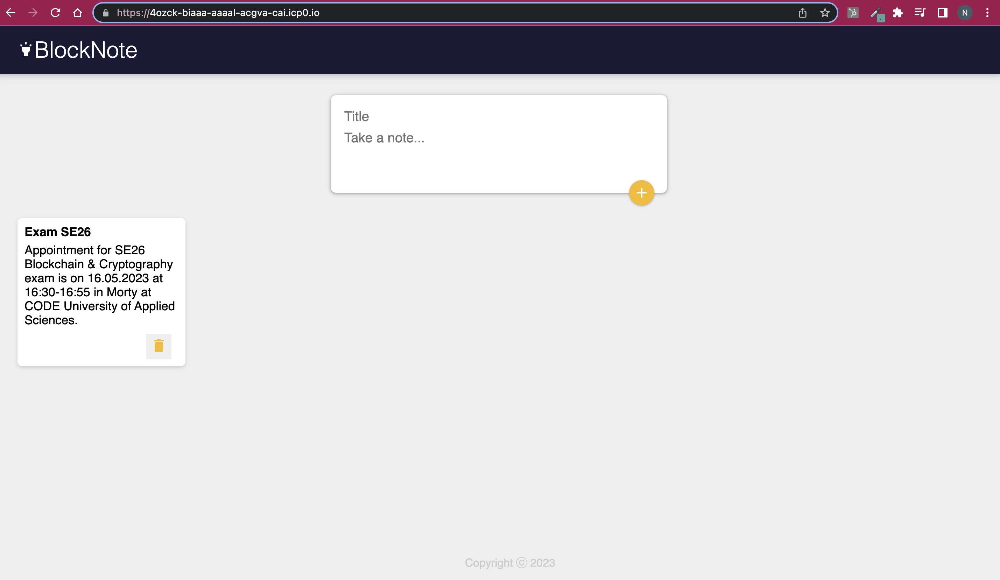
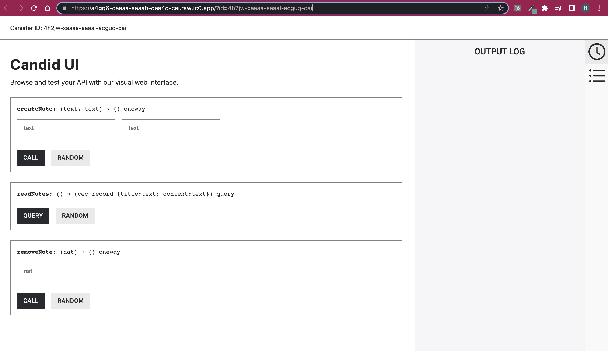

# BlockNote

---

## On-Chain DApp

---

## On-Chain API Documentation

---

A decentralized application for taking note with Kanban style.

## Tech Stack

* Blockchain $\rightarrow$ Internet Computer Protocol.
* Smart Contract $\rightarrow$ Motoko (ICP's native programming language).
* Frontend $\rightarrow$ React JS.

## Production

### Frontend

The frontend for LendLord can be found here:

`https://4ozck-biaaa-aaaal-acgva-cai.icp0.io/`

### Backend

The API documentation for the backend of LendLord is live! And can be found here

`https://a4gq6-oaaaa-aaaab-qaa4q-cai.raw.ic0.app/?id=4h2jw-xaaaa-aaaal-acguq-cai`

## BlockNotes Software Architecture

### Frontend (ReactJS)

Utilizing React JS, it communicates with the backend through HTTP requests for data transmission and application state updates.

### Backend (Node JS)

The backend serves as the bridge between frontend and ICP canisters. It processes incoming HTTP requests from the frontend and communicates with ICP canisters using the DFINITY SDK. The backend employs JSON-RPC or gRPC for encoding requests and decoding responses from ICP canisters.

### ICP Canisters (Motoko Smart Contracts)

The smart contracts is written by ICP's native programming language Motoko and deployed as canisters on the ICP blockchain. Canisters offer an interface callable by the backend to interact with smart contracts, primarily through methods specified in Candid, an ICP-specific interface description language (IDL).

### ICP

ICP blockchain underpins the BLockchain application, furnishing a decentralized, secure, and scalable environment for Motoko smart contracts and canisters. ICP's Consensus and Network Nervous System (NNS) guarantee consistent and synchronized blockchain state across all participating nodes.
