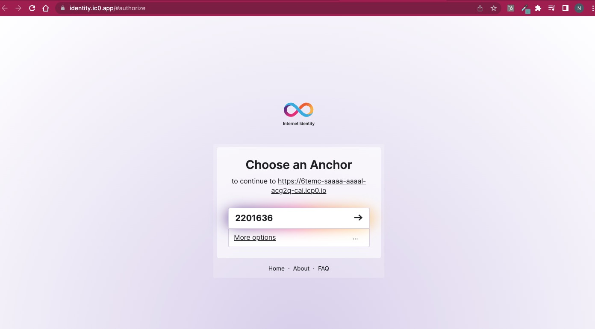
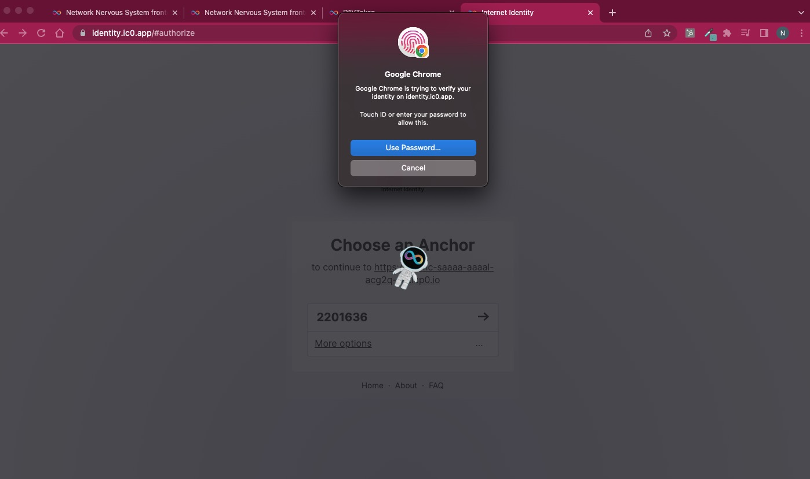
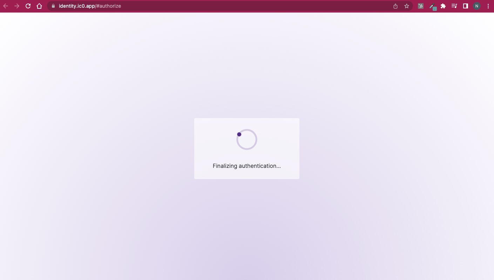
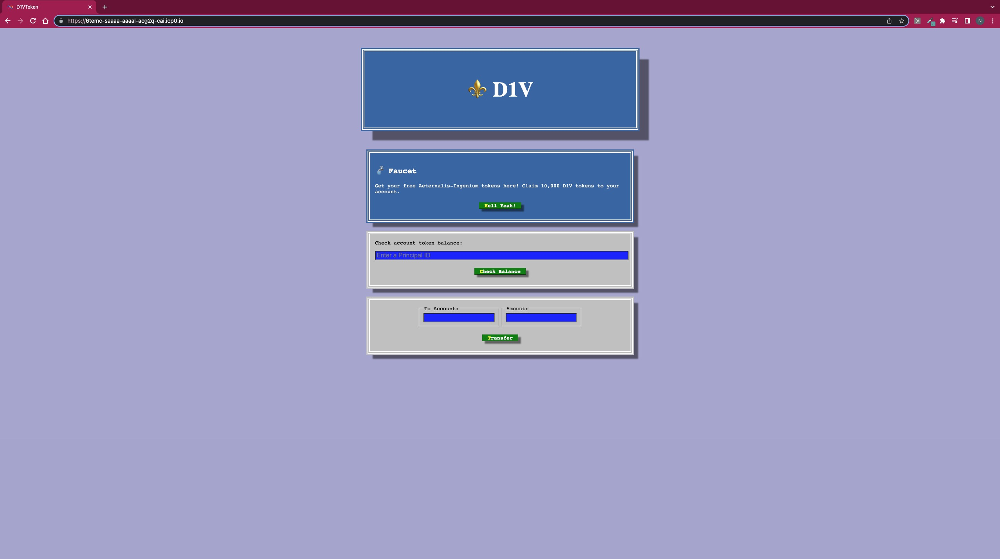
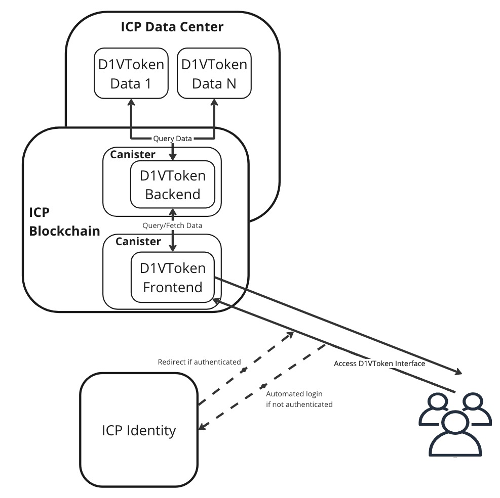

# D1VToken

---

## ICP Identity - Authentication







---

## DApp



---

## Architecture



## Production

Please consider that due to the "Gass Reverse Model" in ICP blockchain, I used an actual ICP token to buy the cycles to deploy my DApp. By the time someone access this DApp online, it could already be taken down. The gass reverse model means that the owner of the platform pays the gass fee for the users.

## Frontned

To access the DApp interface, please ensure that you allow your browser's popio because ICP Identity's program will athenticate your identity (in a normal blockchain, it will be like signing in into your wallet). The frontend can be found here: `https://6temc-saaaa-aaaal-acg2q-cai.icp0.io/`.

## Backend

The backend will show a API documentation (like swagger in a Web2 application) and can be found here: `https://6ufkw-7yaaa-aaaal-acg2a-cai.icp0.io/`.

## Development Setup

* Clone the repository.
* Go into the directory D1VToken.
* Run the following commands to start the development server called "Replica" (in a conventional blockchain, it is the "Testnet") and deploy this DApp into the Replica:

  ```shell
  dfx start --background
  dfx deploy
  ```

* Run the frontend:

  ```shell
  npm start
  ```

* Go to the localhost: `http://localhost:3000`

---

