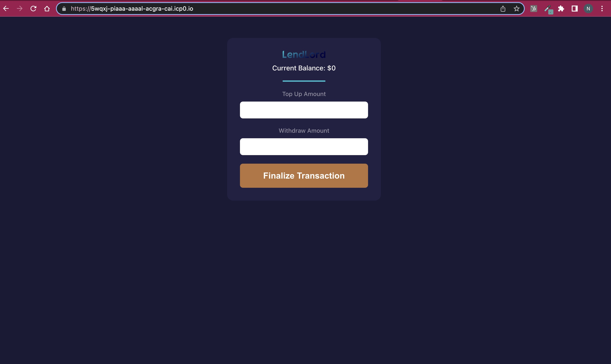
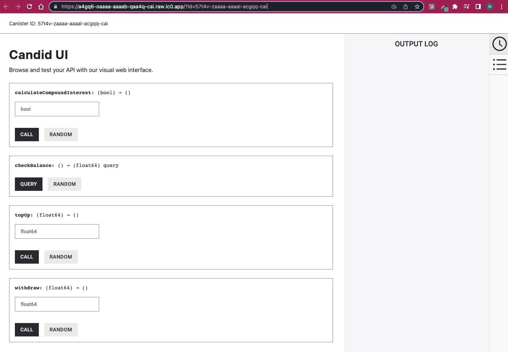

# LendLord

---

## On-Chain DApp

---

## On-Chain API Documentation

---

A decentralized financial application built on Internet Computer Protocol blockchain where users can lend and borrow token to gain APY based on the so-called [compound interest](https://www.investopedia.com/terms/c/compoundinterest.asp). The idea is the longer someone borrow your token, the more that you as the lender get interest back since compound interest is calculated based on the time 😉

## Tech Stack

* Blockchain $\rightarrow$ Internet Computer Protocol.
* Smart Contract $\rightarrow$ Motoko (ICP's native programming language).
* Frontend $\rightarrow$ Vanilla JavaScript.

## Production

### Frontend

The frontend for LendLord can be found here:

`https://5wqxj-piaaa-aaaal-acgra-cai.icp0.io/`

### Backend

The API documentation for the backend of LendLord is live! And can be found here

`https://a4gq6-oaaaa-aaaab-qaa4q-cai.raw.ic0.app/?id=57t4v-zaaaa-aaaal-acgqq-cai`

## LendLord's Software Architecture

### Frontend (Vanila JS)

Utilizing pure JS, the frontend provides an interactive platform for users to engage with the LendLord application. It communicates with the backend through HTTP requests or WebSocket connections for data transmission and application state updates.

### Backend (Node JS)

Implemented with Node.js, the backend serves as a bridge between the frontend and ICP canisters. It processes incoming HTTP requests or WebSocket connections from the frontend and communicates with ICP canisters using the DFINITY SDK. The backend employs JSON-RPC or gRPC for encoding requests and decoding responses from ICP canisters.

### ICP Canisters (Motoko Smart Contracts)

LendLord's core business logic and data reside within Motoko-based smart contracts deployed as canisters on the ICP blockchain. Canisters offer an interface callable by the backend to interact with smart contracts, primarily through methods specified in Candid, an ICP-specific interface description language (IDL).

### ICP

ICP blockchain underpins the LendLord application, furnishing a decentralized, secure, and scalable environment for Motoko smart contracts and canisters. ICP's Consensus and Network Nervous System (NNS) guarantee consistent and synchronized blockchain state across all participating nodes.
