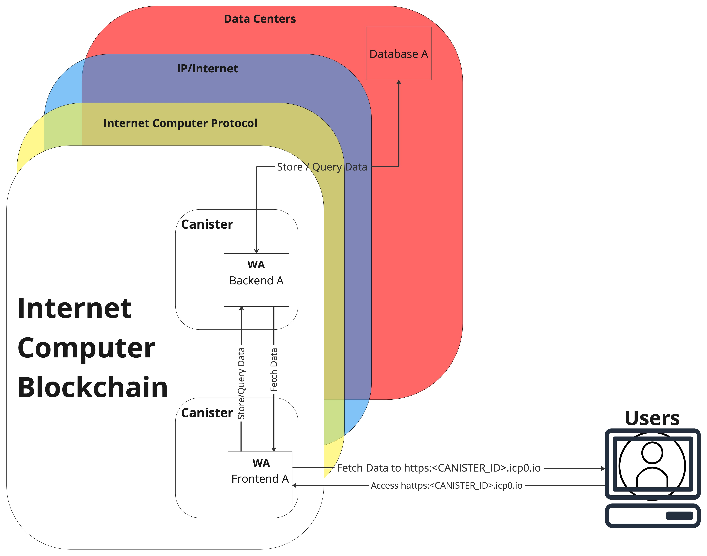

# Decentra1Vorol

---

This is a learning project that showcases my theoretical and practical knowledge about Blockchain. All decentralized applications will be used to pass **SE26 Blockchain & Cryptography** module as a part of my software engineering study program at CODE University of Applied Sciences.

This repository consists of 4 smaller decentralized application as follow:

* LendLord
* BlockNote
* Decentra1Vorol Token
* NFTMarket

Each of the project has its own `README.md`, but the theory for ICP blockchain is documented in the next section in this main README file.

## General Setup

To start any development on ICP blockchain, we need the SDK. Since I'm using Mac, this documentation will only contain Linux/Unix-executable code. If you are using Windows operating system, please visit the official ICP installation guide [here](https://internetcomputer.org/docs/current/developer-docs/setup/install/).

## Development Setup

If you want to test your project locally, you can use the following commands:

```bash
# Starts the replica, running in the background
dfx start --background

# Deploys your canisters to the replica and generates your candid interface
dfx deploy
```

Once the job completes, your application will be available at `http://localhost:4943?canisterId={asset_canister_id}`.

Additionally, if you are making frontend changes, you can start a development server with

```bash
npm start
```

Which will start a server at `http://localhost:8080`, proxying API requests to the replica at port 4943.

## Production

The applications will be in production (live) as long as there are enough "Cycles".

We need to create the canisters for both the backend and the frontend:

```shell
dfx canister --all --network=ci
```

Next, run the following command to deploy it to the ICP network:

```shell
dfx deploy --network ic
```

Now, you will see the live URL for both your backend and frontend applications!

## Front- & Backend Modification

If there is any code modification in either end, the canister needs to be reinstall again. FOr this, run the following command:

```shell
dfx canister install <CANISTER_NAME> --network=ic --mode=reinstall
```

This will update our source code in the ICP canister. Lastly, we need to redeploy with:

```shell
dfx deploy --network ic
```

---

## Internet Computer Protocol


<p align=center>Source: <a href="https://internetcomputer.org/docs/current/home">ICP Blockchain Diagram</a>.</p>

ICP is a novel blockchain technology created by Dominic Williams and the DFINITY Foundation. ICP aims to revolutionize the way we build and interact with decentralized applications by offering unlimited scalability, unparalleled security, and true decentralization. This protocol serves as a seamless extension of the internet, enabling the development and deployment of decentralized applications at scale. The ICP Dashboard cand be found [here](https://dashboard.internetcomputer.org/).

### ICP Blockchain Architecture

All applications deployed in ICP blockchain follow the same architecture/structure to setup the communication between frontend and backend (between canisters) and from backend with data stored in the data storage layer.


<p align=center>ICP Blockchain Architecture in a Nurshell with Full-Stack Application named "A".</p>

### Chain Key Technology

A set of cryptographic techniques enabling rapid transaction finalization and smart contract state updates, utilizing threshold signatures, key resharing, and deterministic randomness.

### Threshold Relay

A consensus mechanism combining Proof-of-Stake (PoS) and Byzantine Fault Tolerance (BFT) systems. Decentralized random beacons generate random values, deterministically selecting subnets responsible for running BFT consensus protocols, achieving finality within seconds.

### Network Nervous System (NNS)

A decentralized, tokenized governance mechanism managing network parameters, upgrades, and resource allocation. Token holders participate in governance by submitting proposals and voting on them.

### Canisters

Self-contained, scalable units of computation and storage running WebAssembly bytecode. Canisters communicate using asynchronous message passing, facilitating the development of composable applications. The ICP network manages resource allocation for canisters, enabling automatic scaling. ICP canisters allow interaction through "query calls" and "update calls," each serving different purposes with distinct characteristics.

* **Query Calls**
Read-only operations that retrieve information without altering the canister's state. Key features include:
  * **Stateless**: No modification to the canister's state
  * **Fast and Free**: Quick execution with no cost to users.
  * **Consistency**: May return stale data but provides speed and cost benefits.
  * **No Consensus**: Interaction with a single replica, no consensus required.

* **Update Calls**
Modify the canister's state through state-changing functions. Key features include:
  * **Stateful**: Can alter the canister's state.
  * **Costly**: Consume resources and incur costs in ICP tokens.
  * **Consistency and Finality**: Strong consistency and irreversible changes through consensus.
  * **Latency**: Consensus process takes more time than query calls.

### Subnets

Specialized groups of nodes processing and storing canister data, interconnected and running in parallel. This structure allows horizontal scaling, handling numerous transactions and smart contract executions simultaneously, while maintaining decentralization and security.

## ICP Cycles


<p align=center>Source: <a href="https://www.coinhustle.com/canisters-explained-an-evolution-of-smart-contracts/">Coinhustle - Canisters Explained</a></p>

**Cycles** are a unit of computation that represents the resources required to execute smart contract code and perform operations on the ICP blockchain. Cycles are consumed when canisters perform actions such as processing requests, storing data, or updating the state of the smart contracts. Cycles serve several purposes in the ICP ecosystem.

### Resource Management

Cycles help to measure and manage the computational resources consumed by canisters. Each canister is allocated a certain number of cycles to use for processing requests, and the ICP blockchain tracks the consumption of these cycles. This mechanism ensures that resources are fairly distributed among canisters and prevents the abuse of the network's computational power.

### Incentivizing Node Providers

Node providers in the ICP network are compensated for their contributions to the system by receiving cycles as rewards. By hosting canisters and processing requests, node providers consume cycles, which they can then redeem for ICP tokens. This creates an incentive for node providers to maintain and operate high-quality infrastructure, contributing to the overall stability and performance of the network.

### Economic Model

Cycles act as a stable, predictable unit of value for computation within the ICP ecosystem. Users and developers can purchase cycles using ICP tokens, which are then used to pay for the execution of their canisters. This establishes a clear relationship between the value of ICP tokens and the cost of computation on the Internet Computer.

It is important to note that cycles are not a separate cryptocurrency or token; they are solely used as a unit of measurement for computation within the ICP ecosystem. Developers and users must ensure that their canisters have sufficient cycles to perform the desired operations, or else their requests may be rejected or their canisters may become inactive due to insufficient resources.

## Why Internet Computer Blockchain?

This project is not only to pass the module SE26 Blockchain & Cryptography, but also to familiarize myself in developing DApp on Internet Computer Blockchain. My venture called [PLENO](https://pleno.earth) will be the big project that I want to build on top of Internet Computer Blockchain.

In March, and April, I conducted a research to find the most scalable blockchain with the following criteria:
* A proper decentralization;
* Stable lifecycle and network;
* Low cost for on-chain data storage.

Here is my research. Please send me a DM on Slack if you don't have the access to my GDrive.


<p align=center><a href="https://docs.google.com/spreadsheets/d/1iUhIPrJHUt_WalwPsJg3h37VgPjTyGr6gn9K3gpGcvk/edit?usp=sharing">Most Scalable Blockchains</a>.</p>

---
